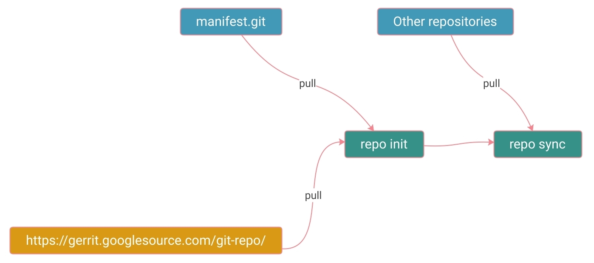

# OP-TEE实用文档

本文档主要记录OP-TEE的安装方法，以及使用gdb调试内核代码的方法。

## 安装

### git repo

OP-TEE整个开发环境的代码需要使用git repo建立。[git repo是依赖于git，负责自动化多个git仓库的拉取和同步的工具](https://source.android.com/setup/develop)，属于AOSP的一部分，与git submodule功能类似。

