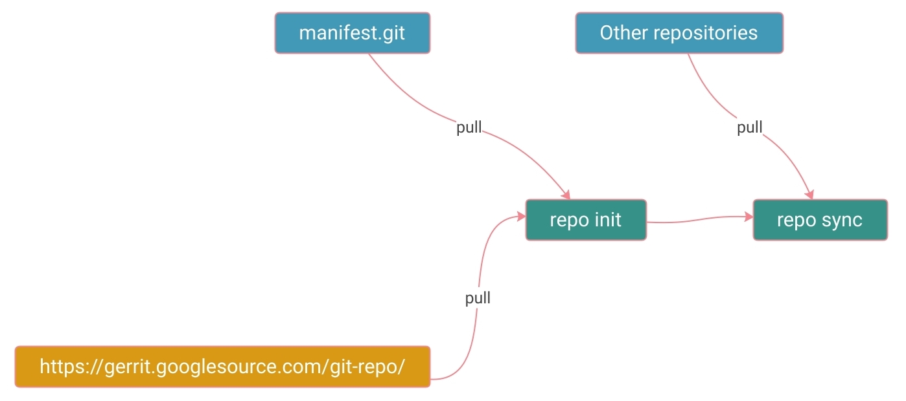

# OP-TEE实用文档

本文档主要记录OP-TEE的安装方法，运行方法，以及使用gdb调试内核代码的方法。

## 安装-代码同步

### 关于git repo

OP-TEE整个开发环境的代码需要使用git repo建立。[git repo是依赖于git，负责自动化多个git仓库的拉取和同步的工具](https://source.android.com/setup/develop)，属于AOSP的一部分，与git submodule功能类似。



整个流程如图。蓝色是OP-TEE的相应git，黄色是git repo所依赖的一个git，绿色是用户需要进行的操作。三个pull操作需要联网。执行完`repo sync`指令后代码就同步完成了。

### 官方代码同步方法

总结自官方文档[prerequisite](https://optee.readthedocs.io/en/latest/building/prerequisites.html)及[build](https://optee.readthedocs.io/en/latest/building/gits/build.html)页面：

#### OS要求

基于Ubuntu的OS。OS不符合要求可能会在"安装相应依赖"一步找不到一些包。

#### 执行指令

```bash
# 安装相应依赖
sudo apt-get install android-tools-adb android-tools-fastboot autoconf \
        automake bc bison build-essential ccache cscope curl device-tree-compiler \
        expect flex ftp-upload gdisk iasl libattr1-dev libc6:i386 libcap-dev \
        libfdt-dev libftdi-dev libglib2.0-dev libhidapi-dev libncurses5-dev \
        libpixman-1-dev libssl-dev libstdc++6:i386 libtool libz1:i386 make \
        mtools netcat python-crypto python3-crypto python-pyelftools \
        python3-pyelftools python-serial python3-serial rsync unzip uuid-dev \
        xdg-utils xterm xz-utils zlib1g-dev
# repo init
# 参数 使用qemu分支: -m default.xml 使用某版本: -b 3.7.0
repo init -u https://github.com/OP-TEE/manifest.git -m default.xml -b 3.7.0
# repo sync
repo sync -j4 --no-clone-bundle
```

### 加速代码同步

执行`repo init`时，需要从`https://gerrit.googlesource.com/`拉取资源，国内会被GFW拦截，repo自带的工具也不能设置代理，所以需要用代理执行`git clone --mirror https://gerrit.googlesource.com/git-repo`将整个仓库以bare的形式拉到本地，然后在`repo init`设定参数：
```bash
repo init --repo-url=<下载的git-repo.git路径> -u https://github.com/OP-TEE/manifest.git -m default.xml -b 3.7.0
```

执行`repo sync`时，也需要从多个来源拉取git仓库，其中包括整个Linux内核，因此速度很慢（一个小时到十几个小时不等）。要解决这个问题，可以在执行`repo sync`之前，在`.repo/manifests/default.xml`中找到所有的相关url，全部用`git clone --mirror`拉到本地（需要一定时间，但是会快一点），然后把`default.xml`里所有的http地址替换成本地的仓库路径。这样之后如果需要重新执行`repo sync`，就可以直接指定使用本地仓库了，将等待时间缩短到小于5分钟。使用命令如`sed -i "s+https://github.com+<本地路径>+g" .repo/manifests/default.xml`可以查找并替换所有的url，便于自动化。

## 安装-build

总结自官方文档[build](https://optee.readthedocs.io/en/latest/building/gits/build.html)页面：

```bash
cd build/
# arm-toolchains, 交叉编译依赖
make -j2 toolchains
# 主make
make -j `nproc`
```

arm-toolchains在make里使用`wget`从互联网获取，有几率失败。可以从浏览器下载相应文件后，修改`toolchains.mk`脚本，让脚本使用本地文件（如替换`wget`为`cp`）就可以解决这个问题。

## 运行方法

build完成若没有错误，进入build文件夹后运行`make run-only`就可以运行；当前的终端将启动gdb，同时会生成两个终端，分别接收来自安全端和非安全端的输出。由于Makefile中`qemu`指令传递了`-S`参数，qemu刚启动时不会运行，需要在qemu终端输入`c`才会开始运行。

### 非GUI下的运行方法

由于在`common.mk:336`定义必须要用`gnome-terminal`或`xterm`生成两个新的终端，而这两个指令只在GUI模式下工作，因此若通过ssh连接Ubuntu，或者是Ubuntu没有图形界面时，会发生类似这样的错误：
```
Unable to init server: Could not connect: Connection refused
# Failed to parse arguments: Cannot open display: 
```

因此要在纯CLI环境下启动虚拟机，需要自己新建两个终端。新建两个终端后，需要用`<OP-TEE根目录>/soc_term/soc_term`工具启动相应接收端口，然后再执行`make run-only`。

在Makefile `run-only`中有定义安全模式输出到`54321`端口，正常模式输出到`54320`端口，因此可以使用这两个快捷方式：

```bash
alias normal-world='<OP-TEE根目录>/soc_term/soc_term 54320'
alias secure-world='<OP-TEE根目录>/soc_term/soc_term 54321'
```

另外，需要修改Makefile中的`run-only`，删除以下两行：
```bash
$(call launch-terminal,54320,"Normal World")
$(call launch-terminal,54321,"Secure World")
```

执行完这个修改后，在`normal-world`与`secure-world`指令都在运行时，执行`make run-only`就可以正常启动OP-TEE了。

## gdb调试-内核代码部分

[对应的官方文档](https://optee.readthedocs.io/en/latest/building/devices/qemu.html#gdb-secure-world)中有较详细的解释。总结如下：

```bash
# (首先启动qemu)
# 使用arm gdb
cd <qemu-v7-project>/toolchains/aarch32/bin
./arm-linux-gnueabihf-gdb -q -tui
# 进入gdb，连接qemu开放的调试端口
(gdb) target remote localhost:1234
# 加载符号表
(gdb) symbol-file <symbol-file>
```

可用命令行快捷方式，如`alias sgdb='cd ~/Workspace/OP-TEE-3.7.0; ./toolchains/aarch32/bin/arm-linux-gnueabihf-gdb -q -tui -s symbol-file ~/Workspace/OP-TEE-3.7.0/optee_os/out/arm/core/tee.elf -ex "target remote localhost:1234"'`自动化这几个命令。

### 可用的符号表

| 概述 | 指令 |
| - | - |
| ATF-BL1 | `symbol-file ~/Workspace/OP-TEE-3.7.0/trusted-firmware-a/build/qemu/debug/bl1/bl1.elf` |
| ATF-BL2 | `symbol-file ~/Workspace/OP-TEE-3.7.0/trusted-firmware-a/build/qemu/debug/bl2/bl2.elf` |
| OP-TEE kernel | `symbol-file ~/Workspace/OP-TEE-3.7.0/optee_os/out/arm/core/tee.elf` |

注：3.6.0及之前版本需要将`trusted-firmware-a`替换为`arm-trusted-firmware`

### 一些重要断点

**bl2: plat_set_my_stack**  
`b bl2/aarch32/bl2_entrypoint.S:99`  
注：此处由于存在bug，gdb需要step in，不能next，否则会直接陷入运行态  
在符号表`bl2.elf`中

**bl2: smc call**  
`b bl2/bl2_main.c:67`  
注：bl2的结束位置  
在符号表`bl2.elf`中

**before bl32: interrupt**  
`b bl1_aarch32_smc_handler`  
注：bl32之前的smc中断  
在符号表`bl1.elf`中

**bl32 entry point**  
`b core/arch/arm/kernel/generic_entry_a32.S:246`  
注：bl32的起始位置  
在符号表`tee.elf`中

**bl32: mmu**  
`b core/arch/arm/kernel/generic_entry_a32.S:461`  
注：bl32在Thread #1进行的内存分配过程  
在符号表`tee.elf`中

## gdb调试-REE代码部分

TBD
