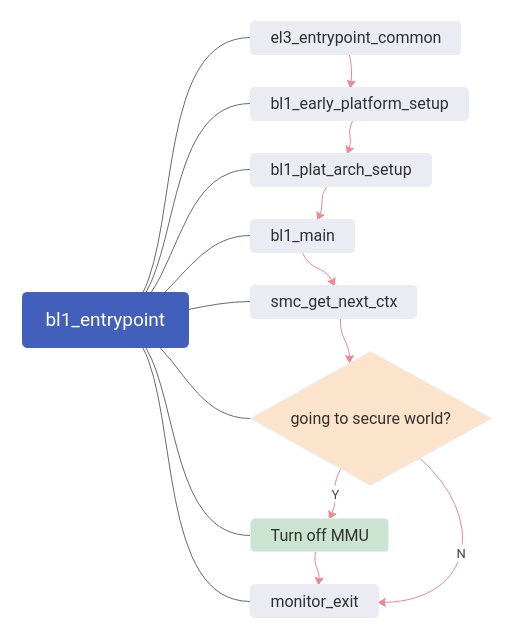
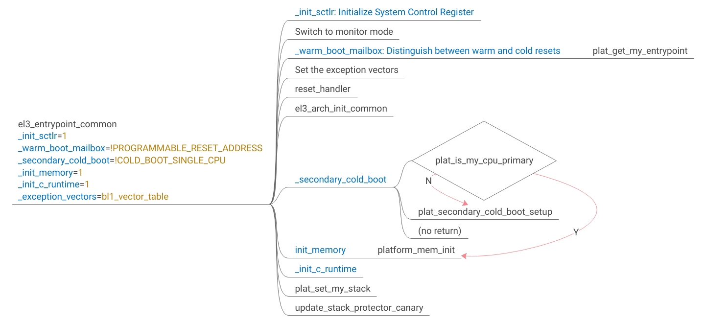
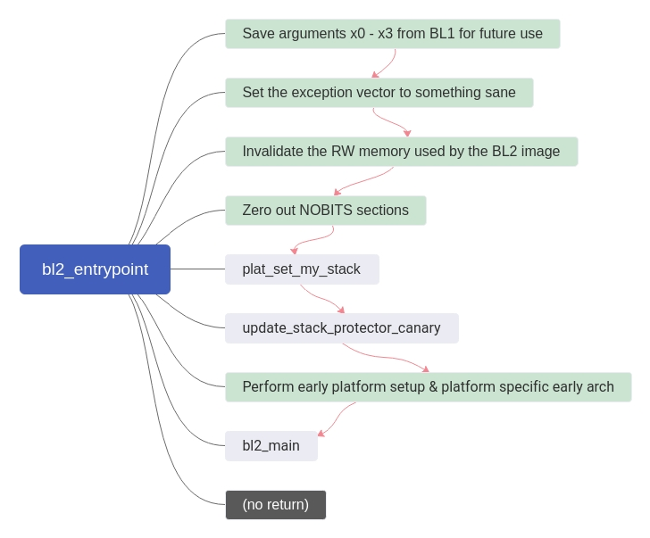
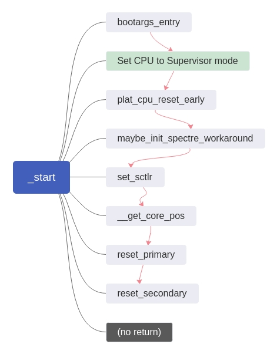

# OP-TEE 代码阅读文档

## BL1

*以下涉及的文件路径都位于`<OP-TEE根目录>/trusted-firmware-a/`下。*

BL1的入口函数是`bl1/aarch32/bl1_entrypoint.S`中的`bl1_entrypoint`（由`bl1/bl1.ld.S`中的`ENTRY(bl1_entrypoint)`确定），其流程图如下。

关于`el3_entrypoint_common`:

## BL2

*以下涉及的文件路径都位于`<OP-TEE根目录>/trusted-firmware-a/`下。*

类似的，BL2的入口函数是`bl2/aarch32/bl2_entrypoint.S`中的`bl2_entrypoint`（由`bl2/bl2_el3.ld.S`中的`ENTRY(bl2_entrypoint)`确定），其流程图如下。

## BL32-MMU

*以下涉及的文件路径都位于`<OP-TEE根目录>/optee_os/`下。*

BL32入口位于`core/arch/arm/kernel/generic_entry_a32.S`的`_start`函数。

其中，MMU相关的部分在Thread #1执行到`reset_primary`中调用`core_init_mmu_map`实现。

## 参考-ARM汇编指令

[参考来源于keil.com](http://www.keil.com/support/man/docs/armasm/armasm_dom1361289850039.htm)

| 指令 | 全称 |
| - | - |
| b | Branch |
| bl | Branch with Link |
| isb | Instruction Synchronization Barrier |
| ldr | Load Register |
| stcopr | ? |
