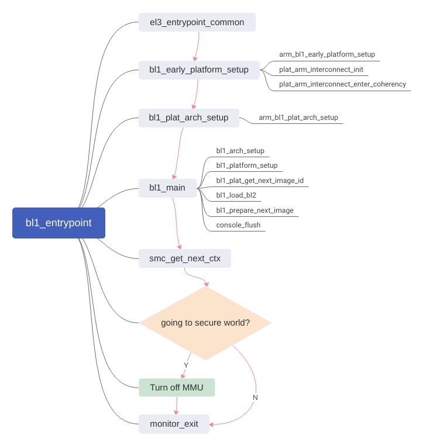

# OP-TEE 代码阅读文档

## BL1

*以下涉及的文件路径都位于`<OP-TEE根目录>/trusted-firmware-a/`下。*

BL1的入口函数是`bl1/aarch32/bl1_entrypoint.S`中的`bl1_entrypoint`（由`bl1/bl1.ld.S`中的`ENTRY(bl1_entrypoint)`确定），其流程图如下。



关于`el3_entrypoint_common`:


## BL2

*以下涉及的文件路径都位于`<OP-TEE根目录>/trusted-firmware-a/`下。*

类似的，BL2的入口函数是`bl2/aarch32/bl2_entrypoint.S`中的`bl2_entrypoint`（由`bl2/bl2_el3.ld.S`中的`ENTRY(bl2_entrypoint)`确定），其流程图如下。


## BL32-MMU

*以下涉及的文件路径都位于`<OP-TEE根目录>/optee_os/`下。*

BL32入口位于`core/arch/arm/kernel/generic_entry_a32.S`的`_start`函数。


其中，MMU相关的部分在Thread #1执行到`reset_primary`中调用`core_init_mmu_map`实现。

## hello_world 程序分析 (Temporarily in English)

### Context & Session

context: A channel for communication on the Normal side

session: A running job on the Secure side, controlled by commands issued from Normal side via a context

### Main function of the client program

`optee_examples/hello_world/host/main.c`:

```C
// Some important lines
res = TEEC_InitializeContext(NULL, &ctx);
res = TEEC_OpenSession(&ctx, &sess, &uuid, TEEC_LOGIN_PUBLIC, NULL, NULL, &err_origin);
res = TEEC_InvokeCommand(&sess, TA_HELLO_WORLD_CMD_INC_VALUE, &op, &err_origin);
TEEC_CloseSession(&sess);
TEEC_FinalizeContext(&ctx);
```

### Related TEE Client API calls

`optee_client/libteec/src/tee_client_api.c` contains the following functions.

#### TEEC_InitializeContext

```C
// Function definition
TEEC_Result TEEC_InitializeContext(const char *name, TEEC_Context *ctx)
    // Some important lines
    fd = teec_open_dev(devname, name, &gen_caps);
    ctx->fd = fd;
    ctx->reg_mem = gen_caps & TEE_GEN_CAP_REG_MEM;
```

Opens a tee device and assigns a context value for the device.

#### TEEC_OpenSession

```C
// Function definition
TEEC_Result TEEC_OpenSession(TEEC_Context *ctx, TEEC_Session *session,
			const TEEC_UUID *destination,
			uint32_t connection_method, const void *connection_data,
			TEEC_Operation *operation, uint32_t *ret_origin)
    // Some important lines
    rc = ioctl(ctx->fd, TEE_IOC_OPEN_SESSION, &buf_data);
```

Initializes `buf_data`, then read related session information via `ioctl` to `&buf_data`.

#### TEEC_InvokeCommand

```C
// Function definition
TEEC_Result TEEC_InvokeCommand(TEEC_Session *session, uint32_t cmd_id,
			TEEC_Operation *operation, uint32_t *error_origin)
    // Some important lines
    rc = ioctl(session->ctx->fd, TEE_IOC_INVOKE, &buf_data);
```

Initializes `buf_data`, then read related session information via `ioctl` to `&buf_data`.

### ioctl System Calls on the Linux TEE Driver

#### Vector Table

In `linux/drivers/tee/tee_core.c`, there is a vector table that receives macros from `ioctl` calls:

```C
// Function definition
static long tee_ioctl(struct file *filp, unsigned int cmd, unsigned long arg)
    // Some important lines
    case TEE_IOC_OPEN_SESSION:
		return tee_ioctl_open_session(ctx, uarg);
	case TEE_IOC_INVOKE:
		return tee_ioctl_invoke(ctx, uarg);
```

#### tee_ioctl_open_session

Also in `linux/drivers/tee/tee_core.c`.

Mostly boundary handling in this function. The real work is done in `open_session`.

```C
// Function definition
static int tee_ioctl_open_session(struct tee_context *ctx,
				  struct tee_ioctl_buf_data __user *ubuf)
    // Some important lines
    rc = ctx->teedev->desc->ops->open_session(ctx, &arg, params);
```

#### optee_open_session

`open_session` mentioned above is contained in `struct tee_driver_ops` at `linux/include/linux/tee_drv.h`. It is constructed at `linux/drivers/tee/optee/core.c`, linking with the function `optee_open_session`.

`optee_open_session` is in `linux/drivers/tee/optee/call.c`. It initializes shared memory for the TA, then copies 2 meta parameters (`msg_arg->params[0].attr` and `msg_arg->params[1].attr`) to shared memory, then calls `optee_do_call_with_arg` to copy the remaining parameters.

#### optee_do_call_with_arg

(Also in `linux/drivers/tee/optee/call.c`)

This function utilizes `&optee->call_queue` and an infinite loop. For each loop, `optee->invoke_fn` is called, passing 8 parameters to the SMC call and carry the return value back in `&res`.

#### invoke_fn

It is located at `struct optee` in `linux/drivers/tee/optee/optee_private.h`. It's instantiated to `*get_invoke_func` in `linux/drivers/tee/optee/core.c`, which in turn calls `optee_smccc_smc`, which in turn calls `arm_smccc_smc`, which in turn translate to:

```asm
ENTRY(__arm_smccc_smc)
	SMCCC SMCCC_SMC
ENDPROC(__arm_smccc_smc)
```

in `linux/arch/arm/kernel/smccc-call.S`.

## 参考-ARM汇编指令

[参考来源于keil.com](http://www.keil.com/support/man/docs/armasm/armasm_dom1361289850039.htm)

| 指令 | 全称 |
| - | - |
| b | Branch |
| bl | Branch with Link |
| isb | Instruction Synchronization Barrier |
| ldr | Load Register |
| stcopr | ? |
